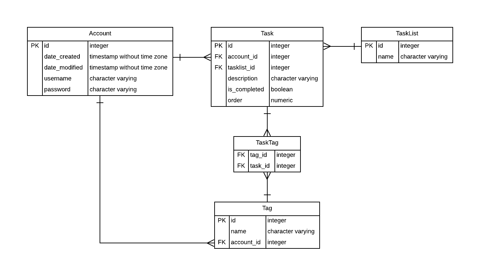

_Last updated: 10.05.2018_

## CREATE TABLE statements

``` sql
CREATE TABLE "Account" (
    id INTEGER NOT NULL, 
    date_created DATETIME, 
    date_modified DATETIME, 
    username VARCHAR NOT NULL, 
    password VARCHAR NOT NULL, 
    PRIMARY KEY (id)
);

CREATE TABLE "TaskList" (
    id INTEGER NOT NULL, 
    name VARCHAR NOT NULL, 
    PRIMARY KEY (id)
);

CREATE TABLE "Tag" (
    id INTEGER NOT NULL, 
    account_id INTEGER NOT NULL, 
    name VARCHAR NOT NULL, 
    PRIMARY KEY (id), 
    FOREIGN KEY(account_id) REFERENCES "Account" (id)
);

CREATE TABLE "Task" (
    id INTEGER NOT NULL, 
    account_id INTEGER NOT NULL, 
    tasklist_id INTEGER NOT NULL, 
    "order" NUMERIC(16) NOT NULL, 
    description VARCHAR NOT NULL, 
    is_completed BOOLEAN, 
    PRIMARY KEY (id), 
    FOREIGN KEY(account_id) REFERENCES "Account" (id), 
    FOREIGN KEY(tasklist_id) REFERENCES "TaskList" (id), 
    CHECK (is_completed IN (0, 1))
);

CREATE TABLE "TaskTag" (
    tag_id INTEGER, 
    task_id INTEGER, 
    FOREIGN KEY(tag_id) REFERENCES "Tag" (id), 
    FOREIGN KEY(task_id) REFERENCES "Task" (id)
);
```
